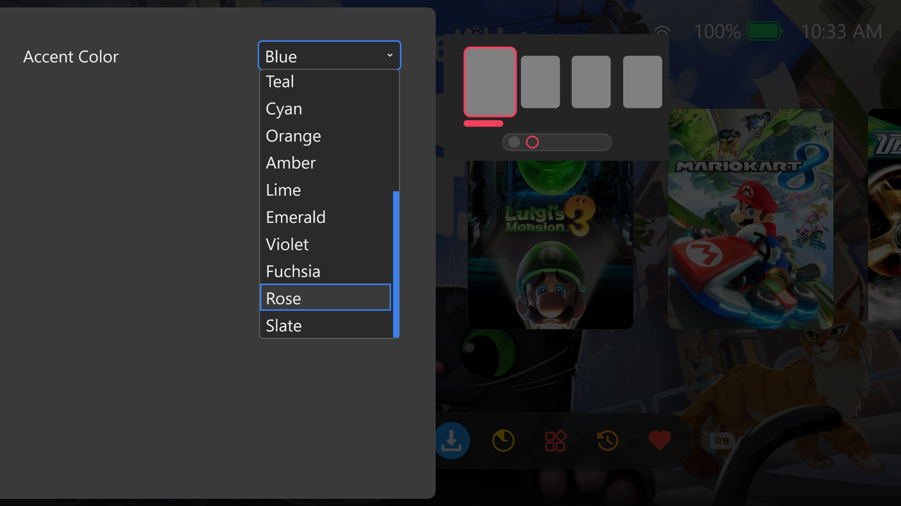

# Toggle

> Something arguably similar but legally distinct from a (light) switch

**Toggle is a Handheld-First Playnite Theme** inspired by modern portable gaming aesthetics and brings sleek, Nintendo Switch 2-inspired design to your handheld PC. This theme prioritizes performance and usability on lower-powered devices while maintaining a polished, minimal appearance.

## Features

- **Optimized Performance**: Lightweight design with minimal overhead, perfect for handheld PCs and gaming tablets
- **Touch-Friendly Interface**: Large, responsive buttons and intuitive navigation designed for touchscreen devices where onscreen controls can be reached by your thumbs
- **Now Playing Integration**: Integrated [Now Playing](https://github.com/jonosellier/NowPlaying) functionality for easy game switching and quick exits
- **Modern Design Language**: Clean rounded corners, inviting color palette, and card-based layouts that feel familiar while maintaining Playnite's powerful library management with support for up to 15 presets.
- **Handheld-Focused**: Purpose-built for portable gaming devices while remaining fully compatible with desktop setups

**Perfect For:**
- ROG Allys, MSI Claws, Legion Gos, and other handheld PC users
- Gaming tablets
- Anyone seeking a performance-conscious theme
- Players who value clean, distraction-free interfaces that work well on smaller screens

## Screenshots

Colorful icons for each filter preset

Up to 15 presets

Manage your gaming session from within Playnite with Now Playing

Easily return to your game from the home screen

ExtraMetadataLoader Support for game logos

## Requirements

Technically you can do whatever you want but the them looks and functions best with this setup

### Playnite Settings

## Recommended Extensions

- ExtraMetadataLoader
- Now Playing